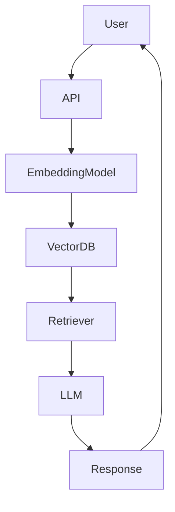
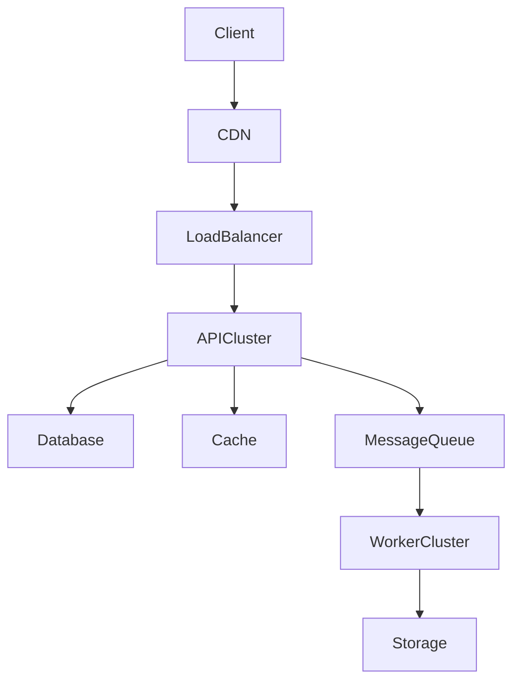

# 🚀 Everest Chima Ukweh

<p align="center">


</p>

<p align="center">


</p>

---

# 🧠 AI Systems Engineer

Senior **Full-Stack Engineer & AI Systems Developer** with **7+ years building scalable platforms** across:

* Artificial Intelligence
* Fintech
* SaaS
* Enterprise Software
* Cloud Infrastructure

I specialize in designing systems that move from:

```
Concept → Architecture → Production → Global Scale
```

---

# 🔥 3D Animated Tech Stack

<p align="center">


</p>

---

# 📊 Live Engineering Dashboard

<p align="center">


</p>

<p align="center">


</p>

---

# 📈 GitHub Contribution Heatmap

<p align="center">


</p>

---

# 📊 Developer Analytics

<p align="center">


</p>

<p align="center">


</p>

<p align="center">


</p>

---

# 🤖 AI Agents Lab

### 🧠 AI Knowledge Agent

Architecture:

* RAG retrieval pipeline
* embeddings vector search
* LLM response generation
* conversation memory layer

Use cases

* knowledge assistants
* enterprise AI search
* AI copilots

---

### 📊 AI Market Intelligence Agent

Features

* predictive sales models
* market trend detection
* ML forecasting pipelines

[https://market-mind-frontend.vercel.app](https://market-mind-frontend.vercel.app)

---

### 🤖 Autonomous AI Customer Agent

Capabilities

* natural language support
* workflow automation
* AI decision support

---

# 🧠 AI Research Lab

Active experimentation in:

### LLM Systems

* fine-tuning transformer models
* retrieval augmented generation
* vector search optimization

### Machine Learning

* survival prediction models
* retail sales forecasting
* AI vs human generated images

### AI Infrastructure

* scalable LLM inference
* AI microservices
* distributed ML pipelines

---

# 🧬 Interactive Architecture Diagrams

### LLM Platform



---

### Scalable SaaS Infrastructure



---

# 📦 Auto-Generated Project Portfolio

<p align="center">


</p>

Your **best repositories appear automatically in pinned projects**.

Recommended pinned repositories:

* AI platform
* LLM tooling
* distributed backend
* machine learning experiments
* cloud infrastructure

---

# 🧾 Open Source Impact

Focus areas:

* developer infrastructure
* backend architecture
* AI engineering patterns
* distributed system design

---

# 🧠 Developer Reputation

<p align="center">


</p>

---

# 🐍 Contribution Snake

<p align="center">


</p>

---

# 🌍 Languages

* English
* Igbo
* Hausa

---

# 📫 Contact

**Email**

```
ukweheverest@gmail.com
```

**LinkedIn**

```
linkedin.com/in/ukweheverest
```

**Portfolio**

```
relativity-codes.vercel.app
```

---

# ⚡ Engineering Philosophy

```
Great systems scale quietly.

The best architecture
solves today's problems
while anticipating tomorrow's complexity.
```

---

# 🧠 Career Timeline

```
2016 — Software Engineering Career Begins
2022 — Programming & Cybersecurity Instructor
2023 — Lead Developer (Walkre Platform)
2024 — Full-Stack Engineer (Enterprise SaaS)
2025 — AI / Machine Learning Engineer
Present — Building AI Systems & Scalable Platforms
```

---

# 🎯 Mission

Building **AI-powered platforms and intelligent systems** that scale globally and solve real-world problems.


